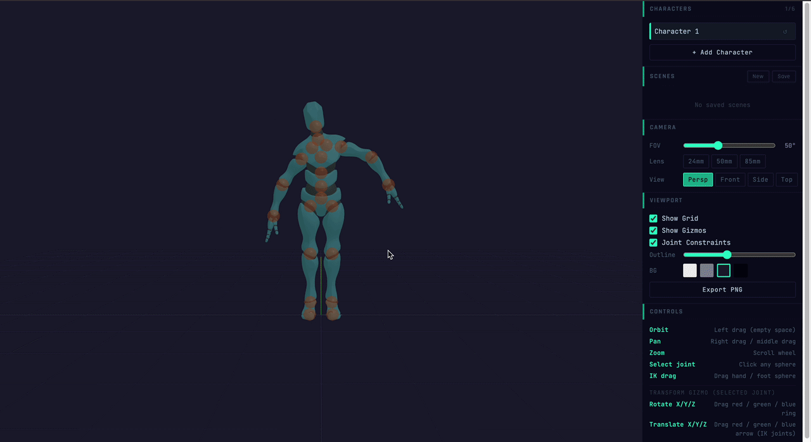

# Web Pose Reference Tool

A browser-based 3D pose reference tool for artists. Drag joint spheres on a humanoid skeleton to create poses for use as drawing references. Designed for clean outline rendering with no dynamic lighting.

No backend — fully client-side.



**[Live demo](https://nekopudding.github.io/web-posing-tool/)**

---

## Features

### Posing & IK

- **Full-body IK** — drag hands, feet, head, or chest; the skeleton solves automatically using FABRIK
- **Inner-bone IK** — drag elbows or knees to reshape a limb without moving the end effector
- **Cascading IK** — when a hand is dragged beyond arm reach, the spine bends and feet stay pinned
- **Pelvis FK** — drag the hips sphere to translate the entire character in world space
- **Joint constraints** — toggleable hinge angle limits on elbows and knees to prevent hyperextension

### Transform Gizmo

- Click any joint to get rotation rings and/or translation arrows depending on the bone
- Rings are aligned to the parent bone's local axes and update every frame as the pose changes
- Single-axis constraint mode for bones that rotate on one plane (elbows, knees)

### Character Management

- **Multiple characters** — add up to 6 characters; each has an independent pose and world position
- **Pose Library** — save named scene snapshots, load or overwrite them, delete with confirmation; persisted in localStorage
- **Undo / redo** — 50-step history, Ctrl+Z / Ctrl+Y (Cmd on Mac)

### Rendering

- Mixamo Y Bot GLB model with real mesh and skeleton
- Inverted-hull outline with adjustable thickness; no post-processing
- Adjustable background color (white, light grey, dark, black)
- Layer visibility — toggle Skin, Muscle, and Bone layers independently

### Camera

- Perspective, Front, Side, Top orthographic presets
- Adjustable FOV (10–120°) and lens presets (24 mm / 50 mm / 85 mm)

### Export

- **Export PNG** — captures the current viewport

---

## Controls

| Action | Input |
|---|---|
| Orbit | Left drag (empty space) |
| Pan | Right drag / middle drag |
| Zoom | Scroll wheel |
| Select joint | Click any sphere |
| IK drag | Drag hand / foot / head sphere |
| Rotate bone (gizmo) | Drag a color ring after selecting a joint |
| Translate bone (gizmo) | Drag a color arrow after selecting a joint |
| Undo | Ctrl+Z / Cmd+Z |
| Redo | Ctrl+Y / Cmd+Y / Ctrl+Shift+Z |

---

## Tech Stack

- **React 18** + TypeScript, Vite 5
- **Three.js r184** — rendering, IK, gizmos
- **Zustand 5** (`subscribeWithSelector`) — all scene state; Three.js synced via subscriptions, not React effects
- **CSS Modules** — scoped styles
- **pnpm**

---

## Architecture

### State management

All serializable scene state lives in `src/store/useSceneStore.ts`. No Three.js objects enter the store — only plain JS values (numbers, strings, `{x,y,z,w}` quaternions). Pose updates during drag happen at 60fps via Zustand subscriptions directly into Three.js, bypassing React reconciliation entirely.

### IK solver (FABRIK)

`src/three/IKSolver.ts` implements the Forward And Backward Reaching IK algorithm operating on world-space position arrays. After solving, `applyToObjects()` converts world positions back to local quaternions on each bone. Bones point along their local +Y axis.

### Rig config

All IK chains and per-bone behavior (drag mode, gizmo flags, foot-lock) are defined in `src/config/rig-config.json`. To change which bones participate in IK or how the gizmo appears, edit only the JSON — no TypeScript changes needed.

```
sphereDrag modes:
  ik           — FABRIK to end effector (hands, feet, head, chest)
  ik-inner     — FABRIK on sub-chain, preserving child world orientation (elbows, knees)
  translate    — translate entire character in world space (hips)
```

### Outline rendering

Inverted hull technique: each mesh is rendered a second time with `BackSide` and vertices expanded along normals. `src/three/OutlineMaterial.ts` returns a `ShaderMaterial`; thickness is a uniform updated by the viewport slider.

### GizmoController

Handles pointer capture, drag plane intersection, IK dispatch, and history push. Writes to the Zustand store only on `pointerup` — Three.js is mutated live during drag to avoid store churn at 60fps.

---

## Project Structure

```
src/
├── config/
│   ├── rig-config.json       ← IK chains + per-bone drag/gizmo config
│   └── RigConfig.ts          ← TypeScript types for the JSON schema
├── store/
│   └── useSceneStore.ts      ← Zustand store — ALL scene state + undo/redo history
├── three/
│   ├── IKChains.ts           ← Bone names, chain defs derived from rig-config.json
│   ├── IKSolver.ts           ← FABRIK IK algorithm
│   ├── OutlineMaterial.ts    ← Inverted hull outline ShaderMaterial
│   ├── GridOverlay.ts        ← Three.js GridHelper + AxesHelper wrapper
│   ├── SceneManager.ts       ← Scene, camera, renderer, render loop
│   ├── CharacterManager.ts   ← Per-character rig, geometry, bone node hierarchy
│   ├── GizmoController.ts    ← Pointer drag → IK → pose update
│   ├── TransformGizmo.ts     ← Rotation rings + translation arrows overlay
│   └── ExportHelper.ts       ← PNG export, pose JSON export/import
├── components/
│   ├── ViewportCanvas.tsx    ← Canvas mount + Three.js lifecycle + Zustand subscriptions
│   └── panels/
│       ├── CharacterRoster.tsx
│       ├── PoseLibraryPanel.tsx
│       ├── BodyTypePanel.tsx
│       ├── LayerPanel.tsx
│       ├── CameraPanel.tsx
│       └── ViewportPanel.tsx
└── styles/
    ├── App.module.css
    ├── ViewportCanvas.module.css
    ├── Panel.module.css
    └── CharacterRoster.module.css
```

---

## Running

```bash
pnpm install
pnpm dev        # dev server at http://localhost:5173
pnpm build      # production build to dist/
pnpm preview    # preview the production build
```
